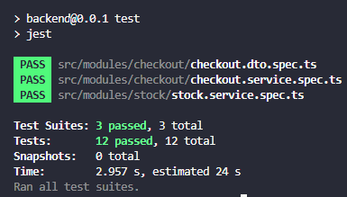
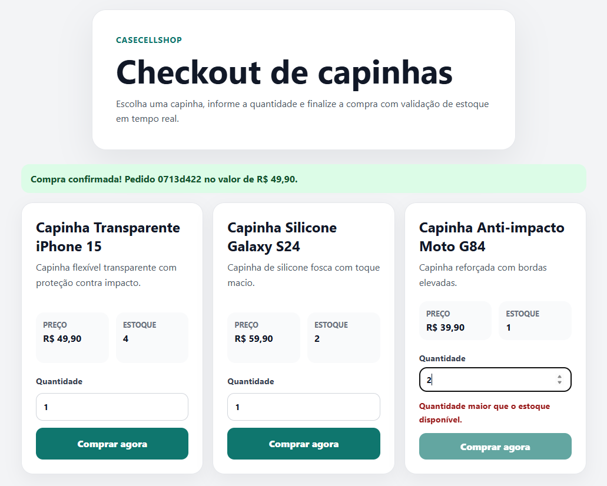
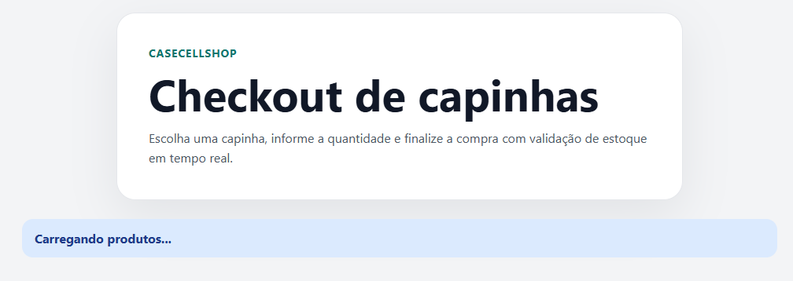
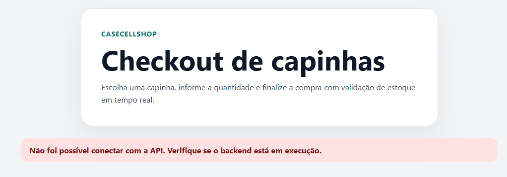
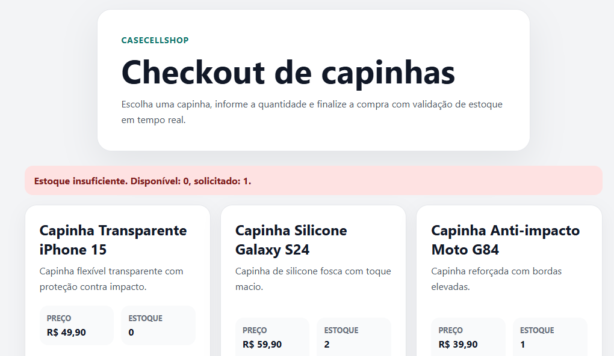
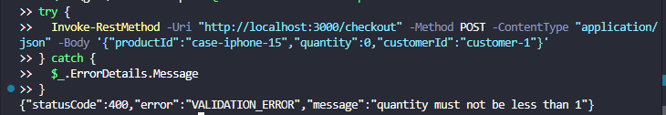
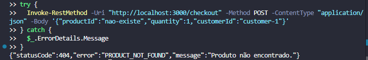
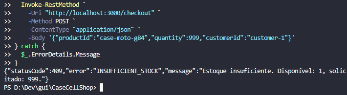
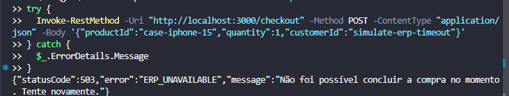

# CaseCellShop

Desafio técnico fullstack júnior.

O projeto implementa um fluxo simples de checkout com validação de entrada, controle de estoque em memória, tratamento de erros HTTP e interface React com estados de carregamento, sucesso e erro.

Repositório público:

```text
https://github.com/Guig-a/CaseCellShop
```

## Stack

- Back-end: Node.js, TypeScript e NestJS.
- Front-end: React, TypeScript e Vite.
- Testes: Jest no back-end.
- Dados: armazenamento em memória.

## Como Rodar

### Back-end

```bash
cd backend
npm install
npm run start:dev
```

API disponível em:

```text
http://localhost:3000
```

### Front-end

Em outro terminal:

```bash
cd frontend
npm install
npm run dev
```

Aplicação disponível em:

```text
http://localhost:5173
```

## Scripts Úteis

Back-end:

```bash
cd backend
npm run build
npm test
```

Front-end:

```bash
cd frontend
npm run build
```

Execução dos testes do back-end:



## Visão da Aplicação

Tela principal do desafio:



Estado de carregamento durante o checkout:



Indisponibilidade da API:



## Endpoints

### `GET /products`

Retorna os produtos disponíveis para compra.

Exemplo de resposta:

```json
[
  {
    "id": "case-iphone-15",
    "name": "Capinha Transparente iPhone 15",
    "description": "Capinha flexível transparente com proteção contra impacto.",
    "price": 49.9,
    "availableStock": 5
  }
]
```

### `POST /checkout`

Cria uma tentativa de compra.

Request:

```json
{
  "productId": "case-iphone-15",
  "quantity": 1,
  "customerId": "customer-1"
}
```

Sucesso:

```json
{
  "orderId": "uuid",
  "status": "CONFIRMED",
  "productId": "case-iphone-15",
  "quantity": 1,
  "unitPrice": 49.9,
  "totalPrice": 49.9,
  "createdAt": "2026-05-22T14:30:00.000Z"
}
```

## Tratamento de Erros

O back-end retorna erros em formato padronizado:

```json
{
  "statusCode": 409,
  "error": "INSUFFICIENT_STOCK",
  "message": "Estoque insuficiente. Disponível: 1, solicitado: 3."
}
```

### Erros na interface

O front-end trata os cenários que o usuário consegue executar no fluxo normal da aplicação: sucesso, carregamento, bloqueio de clique duplicado, validação inline de quantidade acima do estoque, indisponibilidade da API (ver seção **Visão da Aplicação**) e resposta de erro do servidor quando a validação local passou, mas o back-end rejeita a compra — por exemplo, corrida de estoque entre duas abas.

Estoque insuficiente retornado pela API e exibido na UI:



Nesse caso, o back-end confirma o estoque no checkout e devolve a mensagem com a quantidade disponível; a interface exibe o texto retornado pela API.

### Contrato de erros no back-end

Além dos cenários visíveis na interface, o back-end implementa o contrato completo de erros do checkout. Quando a API responde com erro, o front-end exibe a mensagem retornada — inclusive no caso de `503 ERP_UNAVAILABLE`.

O `503` não é acionável pelo fluxo normal da loja porque indisponibilidade de ERP não é uma ação do usuário; em produção, esse status viria de falha real de integração (timeout, ERP fora do ar, circuit breaker). Neste projeto, a simulação usa `customerId: simulate-erp-timeout` no back-end e pode ser verificada via API direta ou testes automatizados.

Alguns erros raramente aparecem na UI no uso comum por desenho intencional: `400` tende a ser bloqueado por validação preventiva antes do envio, e `404` não ocorre porque o usuário só escolhe produtos listados em `GET /products`. Todos permanecem implementados e cobertos por testes.

Exemplos via API direta:









Principais cenários tratados:

- `400 VALIDATION_ERROR`: campos ausentes, tipos inválidos ou quantidade menor que 1. Na UI, tende a ser bloqueado antes do envio.
- `404 PRODUCT_NOT_FOUND`: produto inexistente. Na UI, o usuário só seleciona produtos retornados por `GET /products`.
- `409 INSUFFICIENT_STOCK`: estoque insuficiente. Na UI, validação preventiva ou mensagem da API (como acima).
- `503 ERP_UNAVAILABLE`: indisponibilidade simulada do ERP. A UI exibe a mensagem da API se receber esse status; no fluxo normal da loja, o cenário não é disparado pelo usuário (simulação via back-end/testes).
- `500 INTERNAL_ERROR`: erro inesperado.

## Decisões Técnicas e Trade-offs

Escolhi NestJS no back-end porque ele oferece uma estrutura modular clara para controllers, services, DTOs, validação e testes. Mesmo em um escopo pequeno, essa organização ajuda com a separação de responsabilidades sem criar uma arquitetura pesada.

O TypeScript está em modo `strict` no back-end e no front-end. Para o NestJS, mantive `strictPropertyInitialization: false`, porque DTOs com decorators são preenchidos pelo framework e não por construtores manuais. Isso permite tipagem mais rígida sem brigar com o padrão do Nest.

O estoque e os produtos ficam em memória. Isso simplifica a execução local, evita dependência de banco de dados e mantém o foco do desafio em regra de negócio, validação e tratamento de erros. O trade-off é que os dados são perdidos quando a aplicação reinicia e a solução não serve para múltiplas instâncias em produção.

A consistência de estoque foi tratada com uma fila serializada no `StockService`. Isso evita que duas compras simultâneas consumam o mesmo item quando há apenas uma unidade disponível. Em produção, eu evoluiria isso para uma solução transacional usando banco de dados, Redis ou outro mecanismo distribuído.

O fluxo de checkout é síncrono para essa solução. Para o escopo proposto, isso é suficiente e torna o comportamento fácil de testar. Em produção, a integração com ERP deveria ser assíncrona, com fila, retry e acompanhamento de status.

A indisponibilidade simulada do ERP acontece antes da reserva de estoque para não descontar estoque indevidamente. Esse atalho é válido para o escopo do desafio. Em produção, o cenário correto seria reservar o estoque, tentar o ERP e, em caso de falha, reverter via saga pattern ou compensating transaction.

Os testes foram escritos olhando para comportamento observável. Por exemplo, em vez de testar se um método interno como `setStock` foi chamado, os testes verificam se o estoque realmente foi decrementado após uma compra válida. Isso deixa os testes menos acoplados à implementação.

O cálculo de `totalPrice` usa arredondamento para duas casas decimais antes de retornar a resposta, pois isso evita expor artefatos de ponto flutuante em um campo financeiro.

O erro de estoque insuficiente é representado por uma classe específica, `InsufficientStockError`. O `CheckoutService` diferencia esse erro com `instanceof`, em vez de depender de comparação por texto, mantendo o tratamento de erro mais seguro e explícito.

A indisponibilidade do ERP é simulada com um `customerId` específico, `simulate-erp-timeout`. Essa escolha foi intencional para manter o projeto simples, testável e sem dependência externa. O cenário é garantido no back-end e pode ser demonstrado via API direta ou testes. Em produção, a detecção de falha do ERP viria de timeout real ou circuit breaker, não de um valor especial no payload.

O front-end aplica validações preventivas para melhorar a experiência: desabilita o botão quando a quantidade é inválida, quando o estoque é zero ou enquanto o checkout está em andamento, e exibe mensagem inline quando a quantidade excede o estoque disponível. A UI cobre todos os cenários pertinentes ao fluxo real do usuário: sucesso, loading, bloqueio de ação duplicada, validação de quantidade, indisponibilidade da API (backend offline) e mensagem do servidor quando o estoque muda entre a listagem e o checkout. Erros de contrato como `400` e `404` ficam garantidos no back-end; o `503` também está pronto na UI, mas só seria exibido quando a infraestrutura falhar — não como ação escolhida na interface.

Não usei Docker porque o desafio prioriza simplicidade e execução local fácil. Para esta entrega, `npm install` e `npm run start:dev` são suficientes.

## Parte 1.A - Respostas Conceituais

### Pergunta 1 - Leitura inicial dos problemas

#### Problema 01 - Performance da vitrine

Causa provável: a loja virtual consulta o ERP via API RESTful síncrona a cada requisição de página. O ERP é um monolito legado em datacenter próprio, sem cache, CDN ou paginação otimizada. Com milhões de acessos, o banco MySQL do ERP recebe consultas concorrentes de leitura para dados parecidos de produto, preço e estoque, criando lentidão em cadeia.

Impacto: abandono de sessão logo no primeiro contato. Em e-commerce, cada segundo a mais de carregamento reduz conversão. O cliente chega, não vê produto e vai embora.

Primeira hipótese de investigação: medir o tempo de resposta da API do ERP isoladamente. Se o gargalo estiver no ERP, a solução passa por cache intermediário. Se o problema estiver no volume ou na forma das chamadas, a solução passa por um BFF que agregue e cacheie respostas.

#### Problema 02 - Consistência de estoque

Causa provável: race condition clássica de leitura, verificação e escrita não atômica. Dois clientes consultam o estoque simultaneamente, ambos veem quantidade disponível e ambos concluem a compra. Sem reserva transacional, lock otimista ou operação atômica, a loja vende mais itens do que possui.

Impacto: venda de produto inexistente gera cancelamento, atendimento manual, custo operacional, dano à reputação e perda de confiança.

Primeira hipótese de investigação: verificar se a API do ERP oferece mecanismo de reserva ou lock. Caso não ofereça, introduzir uma camada intermediária com reserva atômica, como Redis com `DECR`/Lua script ou uma fila serializada de operações de estoque.

#### Problema 03 - Resiliência do checkout

Causa provável: o checkout faz chamada síncrona e bloqueante para o ERP registrar pedido e iniciar faturamento. Sob carga alta, o ERP demora, a requisição sofre timeout e o cliente perde o contexto da compra.

Impacto: abandono de carrinho na etapa mais crítica. Também pode haver inconsistência operacional se o pedido ou pagamento avançar sem resposta clara para o cliente.

Primeira hipótese de investigação: desacoplar o checkout do ERP usando fila assíncrona. O checkout aceita a solicitação, retorna rapidamente um status inicial e processa o ERP em background com retry e acompanhamento de status.

### Pergunta 2 - Infraestrutura e Serviços de Apoio

Eu adicionaria uma camada intermediária entre a loja virtual e o ERP para reduzir dependência direta do ERP em cada requisição.

Cache distribuído, como Redis: armazenaria produtos, preços e estoque aproximado com TTL controlado. Isso reduz chamadas repetidas ao ERP e também pode ajudar em operações atômicas simples de reserva.

Fila de mensagens, como RabbitMQ, Kafka ou equivalente: desacoplaria operações lentas, como integração com ERP, faturamento e notificações. O checkout poderia aceitar a compra e processar o ERP depois, evitando timeout para o usuário.

BFF - Backend for Frontend: seria a API própria da loja. Ele agregaria dados, aplicaria cache, validaria entradas e controlaria timeouts, rate limiting e circuit breaker.

CDN para assets estáticos: imagens de produtos, JavaScript e CSS poderiam ser servidos por CDN, reduzindo carga no datacenter e melhorando tempo de carregamento.

Circuit breaker: evitaria que falhas do ERP derrubassem a loja inteira. Quando o ERP estivesse instável, a aplicação poderia retornar dados em cache ou uma resposta controlada.

### Pergunta 3 - SDD: contrato do `POST /checkout`

Antes de codificar, o endpoint precisa receber:

```json
{
  "productId": "string",
  "quantity": 1,
  "customerId": "string"
}
```

Em caso de sucesso, deve retornar `201 Created` com dados do pedido:

```json
{
  "orderId": "uuid",
  "status": "CONFIRMED",
  "productId": "uuid",
  "quantity": 2,
  "unitPrice": 49.9,
  "totalPrice": 99.8,
  "createdAt": "2026-05-22T14:30:00.000Z"
}
```

Em caso de erro, deve retornar status HTTP adequado e mensagem compreensível, como `400`, `404`, `409`, `503` ou `500`.

Definir esse contrato antes de codificar é importante porque cria um acordo claro entre front-end, back-end e testes. O front-end pode desenvolver com mocks, o back-end sabe o comportamento esperado e os testes validam uma especificação, não apenas uma implementação acidental.

### Pergunta 4 - TDD: testes do `POST /checkout`

Eu escreveria testes para:

- compra válida com estoque disponível;
- decremento de estoque após compra válida;
- quantidade inválida;
- produto inexistente;
- estoque insuficiente;
- duas compras simultâneas para estoque unitário;
- indisponibilidade simulada do ERP;
- campos obrigatórios ausentes.

A vantagem de escrever testes antes é transformar o comportamento esperado em especificação executável. Isso força a pensar nos casos de sucesso, erro e borda antes da implementação.

### Pergunta 5 - Uso de IA no desenvolvimento

Eu usaria IA como parceira de desenvolvimento, não como geradora de código solto. A diferença está em como o contexto é estruturado antes de pedir qualquer implementação.

#### Primeiro passo: fornecer especificação, não só descrição

Em vez de descrever o problema em linguagem vaga, eu passaria o contrato já definido: o que o endpoint recebe, o que deve retornar em cada cenário e quais são as regras de negócio. Isso ancora a IA num comportamento esperado, em vez de deixá-la inferir o que o sistema deve fazer.

```text
Contexto: estou implementando POST /checkout em NestJS com dados em memória.

Contrato:
- recebe: productId (string), quantity (number >= 1), customerId (string)
- sucesso: 201 com orderId, status, unitPrice, totalPrice, createdAt
- erros esperados: 400 (validação), 404 (produto não encontrado), 409 (estoque insuficiente), 503 (ERP indisponível)

Regra crítica: duas compras simultâneas para o mesmo produto com estoque = 1
não podem retornar sucesso ao mesmo tempo.

Como implementar o StockService em TypeScript puro, sem banco de dados,
garantindo que essa regra seja respeitada? Explique as opções com trade-offs.
```

#### Segundo passo: implementação guiada pelo contrato

Com a abordagem escolhida, o próximo prompt refina a implementação dentro dos limites do projeto:

```text
Implemente o StockService usando fila serializada com Promise chaining.
Exponha reserve(productId, quantity) e release(productId, quantity).
InsufficientStockError deve ser uma classe customizada para permitir
diferenciação via instanceof no CheckoutService.
Inclua um método reset() para uso nos testes.
```

#### Terceiro passo: testes escritos contra o contrato, não contra a implementação

```text
Escreva testes Jest para o CheckoutService cobrindo os cenários do contrato:
1. compra válida retorna 201 com os campos esperados;
2. compra válida decrementa o estoque;
3. quantity inválida retorna 400;
4. produto inexistente retorna 404;
5. estoque insuficiente retorna 409 sem alterar o estoque;
6. duas compras simultâneas para estoque unitário: apenas uma retorna 201;
7. ERP indisponível retorna 503 sem alterar o estoque.

Os testes devem verificar comportamento observável, não chamadas internas.
```

#### Quarto passo: revisão crítica

```text
Revise essa implementação e aponte o que falha em produção:
- O que acontece com o estoque se o processo reiniciar?
- O que acontece se a reserva for feita, mas o ERP falhar depois?
- Essa solução funciona com múltiplas instâncias da aplicação?

Sugira como evoluir cada ponto.
```

Esse encadeamento funciona porque cada prompt parte de um contrato definido, não de uma intenção vaga. A IA gera código que já sabe o que deve fazer e como deve falhar. A revisão crítica no final força a explicitação dos limites da solução, transformando o uso de IA em algo que também documenta trade-offs, não só produz código.

