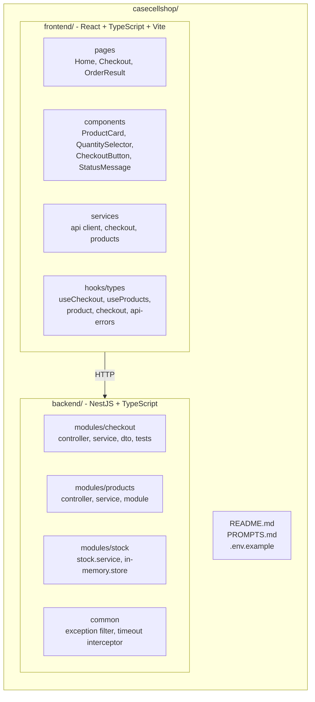
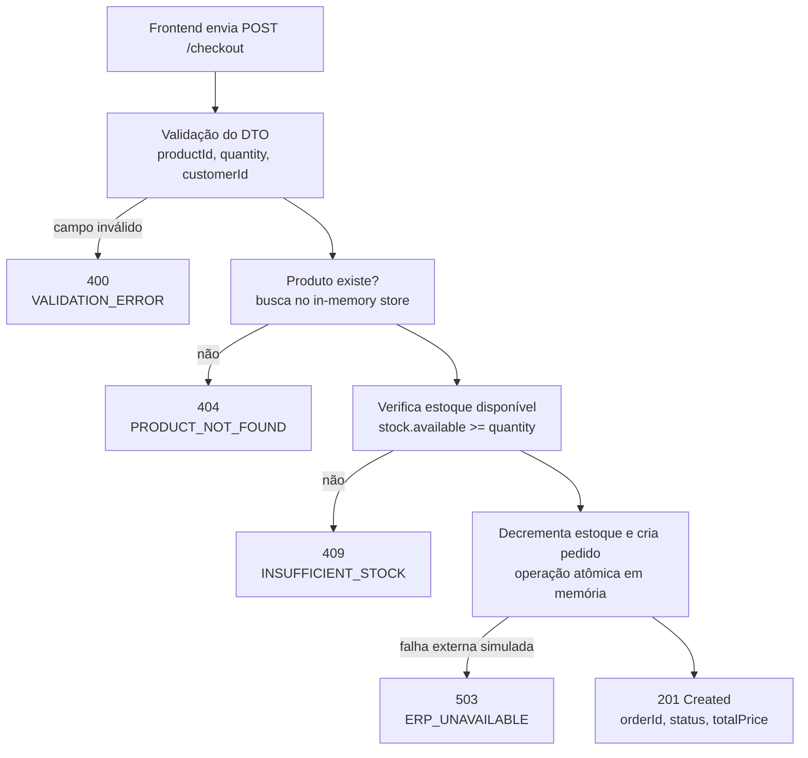

> Documento interno de implementação.
> Este arquivo serve como contexto para IA, guia arquitetural e referência de qualidade durante o desenvolvimento.
> Ele não substitui o `README.md`, o `PROMPTS.md` nem a resposta formal do desafio.

# CaseCellShop - Spec Operacional

## Objetivo deste documento

Este documento orienta a construção do projeto CaseCellShop de forma consistente, simples e verificável.

Ele deve ser usado para:

- guiar a IA durante a implementação;
- reduzir ambiguidade sobre escopo e arquitetura;
- padronizar contratos entre backend e frontend;
- manter commits pequenos e rastreáveis;
- evitar complexidade desnecessária;
- garantir que a entrega final cumpra o desafio técnico.

Este arquivo **não é**:

- README do projeto;
- documento final para recrutador;
- `PROMPTS.md`;
- resposta formal da Parte 1.A.

Os artefatos públicos de entrega serão criados separadamente:

- `README.md`: como rodar, decisões técnicas, estrutura e link/explicação da entrega.
- `PROMPTS.md`: prompts relevantes usados com IA.
- Código em `backend/` e `frontend/`: implementação executável.

## Diretrizes de desenvolvimento

- Priorizar clareza, simplicidade e execução local fácil.
- Evitar abstrações que não ajudem diretamente no escopo do desafio.
- Usar TypeScript com tipagem explícita nas fronteiras principais: DTOs, services, responses e tipos de API.
- Manter backend e frontend desacoplados por contrato HTTP.
- Implementar dados em memória, sem banco real.
- Não usar Docker neste projeto.
- Validar entradas no backend, mesmo que o frontend também valide.
- Tratar erros com respostas HTTP adequadas e mensagens compreensíveis.
- Evitar estados ambíguos no frontend: sempre mostrar loading, sucesso ou erro.
- Preferir testes focados nos riscos do desafio: validação, estoque e checkout.


## Stack escolhida

- **Back-end:** Node.js + TypeScript + NestJS
- **Front-end:** React + TypeScript + Vite
- **Dados:** armazenamento em memória
- **Docker:** não utilizado

Motivo da escolha:

- NestJS demonstra organização modular sem fugir da stack pedida.
- React + Vite oferece setup simples e rápido para a interface.
- Dados em memória reduzem complexidade e mantêm foco em regra de negócio.
- Sem Docker reduz atrito para quem for executar o projeto localmente.

O desafio valoriza clareza, simplicidade, tratamento de erros, validação mínima e comunicação de trade-offs. A stack escolhida deve servir a esses pontos, não competir com eles.

## Arquitetura prevista do repositório

```text
casecellshop/
├── backend/
│   ├── src/
│   │   ├── modules/
│   │   │   ├── checkout/
│   │   │   │   ├── checkout.controller.ts
│   │   │   │   ├── checkout.service.ts
│   │   │   │   ├── checkout.dto.ts
│   │   │   │   ├── checkout.module.ts
│   │   │   │   └── checkout.service.spec.ts
│   │   │   ├── products/
│   │   │   │   ├── products.controller.ts
│   │   │   │   ├── products.service.ts
│   │   │   │   └── products.module.ts
│   │   │   └── stock/
│   │   │       ├── stock.service.ts
│   │   │       ├── stock.module.ts
│   │   │       └── in-memory.store.ts
│   │   ├── common/
│   │   │   ├── filters/
│   │   │   │   └── http-exception.filter.ts
│   │   │   └── interceptors/
│   │   │       └── timeout.interceptor.ts
│   │   ├── app.module.ts
│   │   └── main.ts
│   └── jest.config.ts
├── frontend/
│   ├── src/
│   │   ├── pages/
│   │   │   ├── Home.tsx
│   │   │   ├── Checkout.tsx
│   │   │   └── OrderResult.tsx
│   │   ├── components/
│   │   │   ├── ProductCard.tsx
│   │   │   ├── QuantitySelector.tsx
│   │   │   ├── CheckoutButton.tsx
│   │   │   └── StatusMessage.tsx
│   │   ├── services/
│   │   │   ├── api.ts
│   │   │   ├── checkout.ts
│   │   │   └── products.ts
│   │   ├── hooks/
│   │   │   ├── useCheckout.ts
│   │   │   └── useProducts.ts
│   │   └── types/
│   │       ├── product.ts
│   │       ├── checkout.ts
│   │       └── api-errors.ts
├── README.md
├── PROMPTS.md
└── .env.example
```



## Fluxo do checkout




## Escopo funcional

Implementar um pequeno fluxo de checkout para compra de capinhas de celular.

O usuário deve conseguir:

- visualizar produtos disponíveis;
- informar uma quantidade;
- iniciar uma tentativa de compra;
- receber feedback de carregamento;
- ser impedido de clicar várias vezes durante o processamento;
- visualizar mensagens compreensíveis em caso de sucesso ou erro.

## Requisitos do backend

- Criar uma API NestJS.
- Expor `GET /products`.
- Expor `POST /checkout`.
- Usar DTO para validar entrada do checkout.
- Ativar `ValidationPipe` global.
- Representar produtos e estoque em memória.
- Decrementar estoque apenas quando a compra for válida.
- Impedir venda acima do estoque disponível.
- Retornar HTTP adequado para cada cenário.
- Padronizar formato de erro.
- Simular indisponibilidade/timeout do ERP de forma simples, se isso não aumentar demais o escopo.

## Requisitos do frontend

- Criar aplicação React com Vite e TypeScript.
- Exibir lista simples de produtos.
- Permitir seleção de quantidade.
- Enviar tentativa de compra para `POST /checkout`.
- Exibir estado de carregamento durante a compra.
- Desabilitar ação duplicada enquanto a requisição estiver em andamento.
- Exibir mensagem de sucesso quando a compra for confirmada.
- Exibir mensagem amigável para erro de validação, produto inexistente, estoque insuficiente ou indisponibilidade.

## Requisitos de qualidade

- Código organizado por responsabilidade.
- Nomes de arquivos e funções devem comunicar intenção.
- Evitar lógica de negócio dentro de controllers ou componentes visuais.
- Backend deve concentrar regra de checkout em service.
- Frontend deve isolar chamadas HTTP em `services/`.
- Hooks podem controlar estado de tela, loading e erro.
- Testes automatizados devem cobrir os fluxos mais importantes.
- README e PROMPTS.md devem ser criados apenas quando a base funcional estiver pronta ou próxima disso.

## Contrato resumido da API

### `GET /products`

Retorna os produtos disponíveis para a vitrine.

Resposta esperada:

```json
[
  {
    "id": "case-iphone-15",
    "name": "Capinha Transparente iPhone 15",
    "description": "Capinha flexível transparente",
    "price": 49.9,
    "availableStock": 5
  }
]
```

### `POST /checkout`

Cria uma tentativa de compra.

Request:

```json
{
  "productId": "case-iphone-15",
  "quantity": 1,
  "customerId": "customer-1"
}
```

Sucesso:

```json
{
  "orderId": "order-uuid",
  "status": "CONFIRMED",
  "productId": "case-iphone-15",
  "quantity": 1,
  "unitPrice": 49.9,
  "totalPrice": 49.9,
  "createdAt": "2026-05-22T14:30:00.000Z"
}
```

Erro:

```json
{
  "statusCode": 409,
  "error": "INSUFFICIENT_STOCK",
  "message": "Estoque insuficiente para concluir a compra."
}
```

## Regras de erro

O backend deve seguir um formato previsível para erros:

```json
{
  "statusCode": 400,
  "error": "VALIDATION_ERROR",
  "message": "Mensagem compreensível para o usuário ou desenvolvedor."
}
```

Códigos esperados:

| HTTP | Código interno | Quando usar |
| --- | --- | --- |
| 400 | `VALIDATION_ERROR` | Body inválido, quantidade inválida ou campos obrigatórios ausentes |
| 404 | `PRODUCT_NOT_FOUND` | Produto não existe no armazenamento em memória |
| 409 | `INSUFFICIENT_STOCK` | Quantidade solicitada maior que estoque disponível |
| 503 | `ERP_UNAVAILABLE` | Falha externa simulada ou timeout |
| 500 | `INTERNAL_ERROR` | Erro inesperado |

## Cenários de teste prioritários

Backend:

- Compra válida retorna `201 Created`.
- Compra válida decrementa estoque.
- `quantity = 0` retorna `400 VALIDATION_ERROR`.
- Produto inexistente retorna `404 PRODUCT_NOT_FOUND`.
- Estoque insuficiente retorna `409 INSUFFICIENT_STOCK`.
- Duas compras concorrentes para estoque unitário não podem retornar sucesso ao mesmo tempo.

Frontend:

- Lista produtos retornados pela API.
- Permite alterar quantidade.
- Desabilita botão durante envio do checkout.
- Mostra mensagem de sucesso após compra confirmada.
- Mostra mensagem compreensível para erro de estoque.
- Mostra mensagem compreensível para indisponibilidade da API.

## Ordem de implementação

1. Criar commit inicial com este `spec.md`.
2. Criar backend NestJS.
3. Implementar store em memória de produtos e estoque.
4. Implementar `GET /products`.
5. Definir DTO e contrato do `POST /checkout`.
6. Criar testes principais do fluxo de checkout.
7. Implementar regra de checkout e decremento de estoque.
8. Implementar tratamento de erro.
9. Garantir que os testes do backend estejam passando.
10. Criar frontend React + Vite.
11. Implementar listagem de produtos.
12. Implementar formulário de checkout.
13. Implementar loading, bloqueio de clique duplicado e mensagens.
14. Adicionar testes principais do frontend.
15. Criar README.
16. Criar PROMPTS.md.
17. Revisar execução completa local.

## Decisões e trade-offs

- Dados em memória são suficientes para o desafio, mas não sobrevivem a restart da aplicação.
- A solução em memória permite demonstrar validação, regras de negócio e estados de erro sem adicionar banco de dados.
- NestJS adiciona estrutura e organização, mas ainda mantém a execução simples.
- Docker foi evitado para reduzir atrito na avaliação.
- O checkout síncrono é aceitável na mini-tarefa.
- Em produção, o checkout deveria evoluir para reserva transacional, fila, retry e processamento assíncrono com ERP.
- A consistência de estoque em memória resolve o exercício, mas não é solução distribuída para múltiplas instâncias.

## Definition of Done

- Backend sobe localmente sem erro.
- Frontend sobe localmente sem erro.
- `GET /products` retorna produtos.
- `POST /checkout` cria compra válida.
- Entradas inválidas retornam erro adequado.
- Estoque insuficiente retorna erro adequado.
- Interface exibe loading durante checkout.
- Interface impede clique duplicado.
- Interface mostra mensagens claras de sucesso e erro.
- Testes principais passam.
- README explica como rodar.
- PROMPTS.md registra prompts relevantes.
- Histórico de commits segue Conventional Commits.
